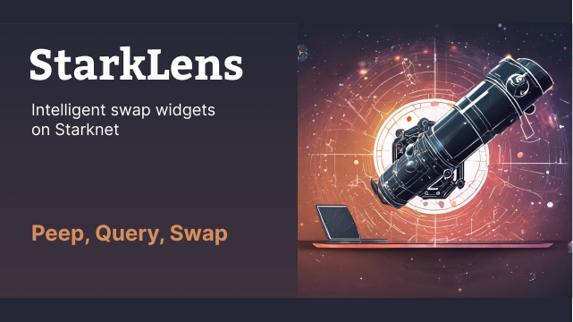
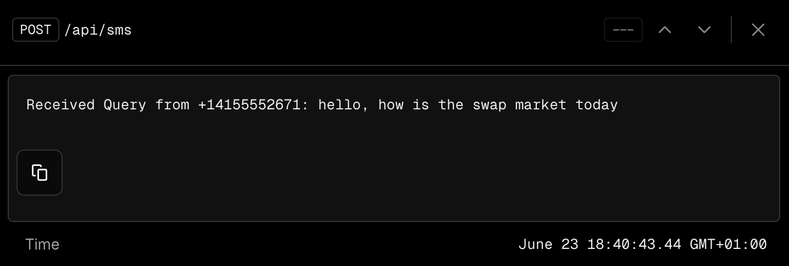
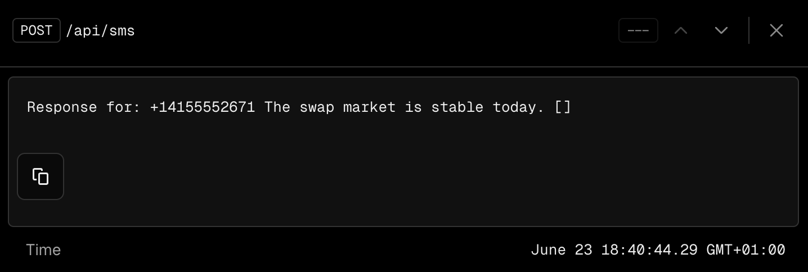
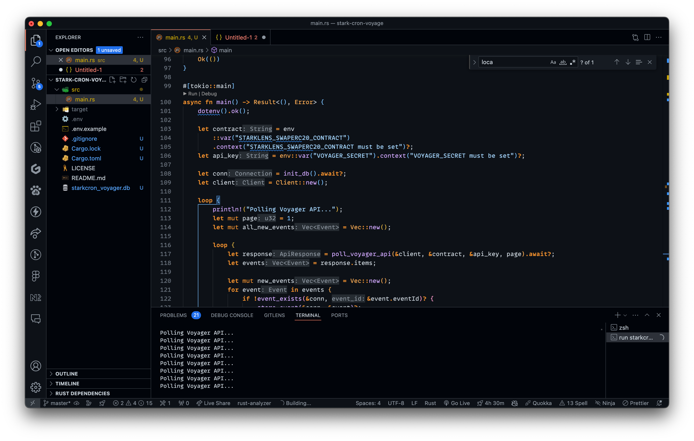

# Hi there 👋

Own your swaps with **StarkLens**. An intent-based, intelligent widget to seamlessly query, manage, and execute swaps with ease.

### Quick Links

- [EthGlobal Page](https://ethglobal.com/showcase/starklens-u4n7q)
- [Smart Contract](https://github.com/acgodson/starklens/blob/dd834c9bb788248bb841104e6709c176b7d05b53/contract/src/lens_swap_erc20.cairo)
- [Indexer DB](https://github.com/acgodson/starklens/blob/dd834c9bb788248bb841104e6709c176b7d05b53/app/api/indexer/route.ts)

### ERC20Swap Contract

- Written in Cairo, this contract permits token swaps between counterparties. Swap intents can be gated by limiting to either `Account Gating`, `NFT Gating`, or `Minimum Balance`.

| Network          | Contract Address                                                                                                                                                      |
| ---------------- | --------------------------------------------------------------------------------------------------------------------------------------------------------------------- |
| Starknet Sepolia | [0x036a2db9afc1380505ae547877f77ece7e2f15d6dc9883f7d9f9b25002d01961](https://sepolia.voyager.online/contract/0x036a2db9afc1380505ae547877f77ece7e2f15d6dc9883f7d9f9b25002d01961#events) |

### StarkLens AI

We created a [Node.js package](#) that allows projects to query swap intents on Starknet using OpenAI's model to process pre-classified prompts routed from Langchain.

### StarkLens Offline Inquiry

`On-Message-Receive`, the dedicated phone number from Twilio is configured to send a POST request to our endpoint [`api/sms`](app/api/sms).

## Localhost Indexer

